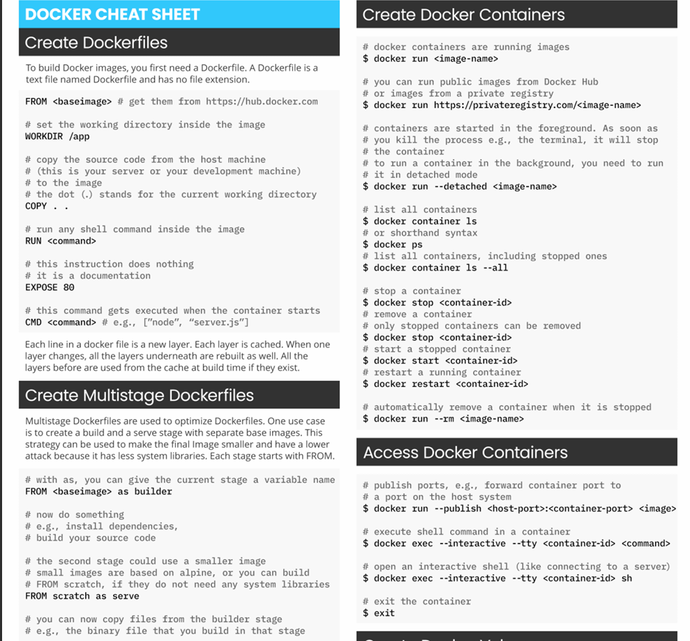

# DockerCheatSheet 🐳

I built this Docker cheat sheet as a handy reference for myself and others who work with containers regularly. It covers not only the everyday commands most developers use, but also the less obvious ones that often come in handy — like managing networks, volumes, and multi-stage builds. Instead of digging through documentation each time, this guide provides a quick, practical way to recall the essentials and streamline your workflow.

  

